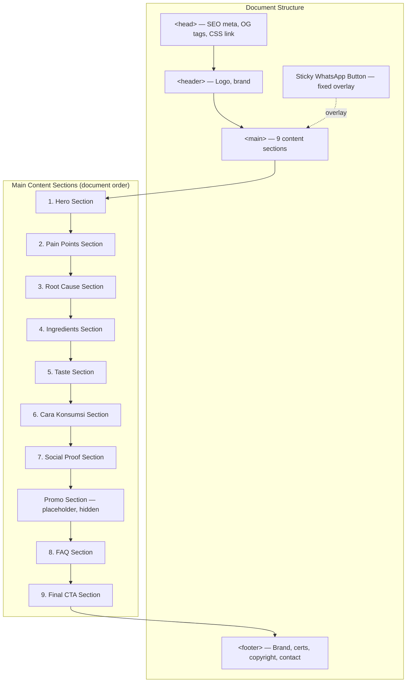
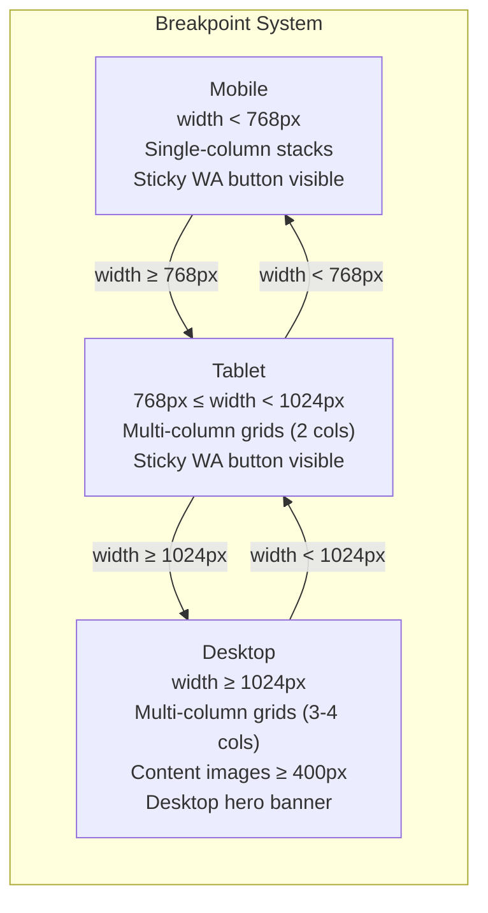
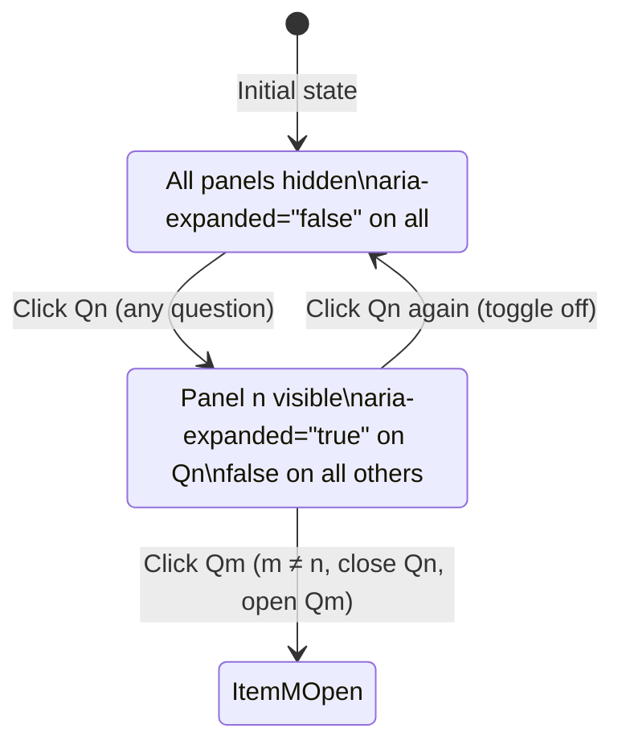

# Design Document: TinyHoney Landing Page

## Overview

The TinyHoney landing page is a static single-page website built with vanilla HTML, CSS, and JavaScript — no frameworks, no build tools, no server-side rendering. The page markets a children's honey supplement to Indonesian mothers ("Bunda") through a conversion-focused content flow: problem awareness → root-cause education → solution presentation → social proof → action.

The design prioritizes three concerns: (1) fast initial render on mobile networks in Indonesia, (2) accessibility for all visitors including assistive technology users, and (3) a maintainable structure that allows a marketer to insert promotional content (Promo_Section) without code changes.

### Design Decisions and Rationale

- **No build tools or frameworks**: The target audience loads this page on mobile networks. A zero-dependency static page eliminates framework overhead, JS bundle size, and build complexity. Every byte matters for the 2.5s hero render and 5s full-load targets.
- **Mobile-first CSS**: The majority of Indonesian web traffic is mobile. Writing mobile styles first and progressively enhancing at breakpoints keeps the mobile CSS path shortest and avoids overwriting desktop styles on mobile.
- **Single CSS file, single JS file**: Simplifies the delivery chain. One render-blocking CSS link in `<head>`, one deferred JS file before `</body>`.
- **`<picture>` element for hero banner**: The browser selects the appropriate image based on viewport, avoiding downloading both desktop and mobile banners.
- **Custom ARIA accordion over `<details>`**: Requirement 10.6 (single-open behavior) and 17.5 (explicit state indication to assistive technology) are easier to implement with a button-based ARIA pattern than with native `<details>`.
- **WhatsApp link construction as a pure function**: Extracting `buildWhatsAppUrl(phone, message)` into a testable pure function enables property-based testing of URL encoding correctness.
- **Accordion state machine as a pure reducer**: Extracting the accordion toggle logic into `accordionReducer(state, action)` enables property-based testing of state transitions, round-trips, and invariants.

## Architecture

### File Structure

```
tinyhoney-lp/
├── index.html              # Single HTML document (all 9 sections + footer)
├── css/
│   └── styles.css          # Single stylesheet (mobile-first, minified for production)
├── js/
│   └── main.js             # Single JS file (deferred — accordion, WhatsApp links, lazy-load fallback)
├── assets/
│   ├── images/             # Content images (PNG/JPG)
│   │   ├── banner-desktop.png
│   │   ├── banner-mobile.png
│   │   ├── ibu-anak-tinyhoney.png
│   │   ├── pencernaan-sehat.png
│   │   ├── product-only.png
│   │   ├── product-podium.png
│   │   ├── produk-halal-bpom.png
│   │   ├── logo-bpom.png
│   │   ├── logo-halal.png
│   │   ├── komposisi/      # 7 ingredient images
│   │   ├── problem/        # 4 problem images
│   │   └── testimoni/      # 6 testimoni images (3.png–8.png)
│   └── logo/               # Logo assets (WebP)
│       ├── logo.webp
│       ├── icon-big.webp
│       ├── icon-small.webp
│       └── icon.png
```

### Page Architecture Diagram



### Technology Stack

| Concern | Choice | Rationale |
|---------|--------|-----------|
| Markup | HTML5 semantic elements | Accessibility (Req 17.4), SEO |
| Styling | Vanilla CSS, mobile-first | Performance, no preprocessor needed |
| Interactivity | Vanilla ES6+ JavaScript | No framework overhead, deferred loading |
| Images | PNG/JPG content, WebP logos | WebP for logos (already provided), PNG/JPG for content |
| Fonts | System font stack + optional self-hosted Poppins | Performance — avoids render-blocking font fetch |

### CSS Organization

The single `styles.css` file is organized into logical sections using CSS custom properties (design tokens) and a BEM-like naming convention (`block__element--modifier`):

```css
/* ============================================
   1. CSS Custom Properties (Design Tokens)
   ============================================ */
:root {
  /* Colors — warm, natural, trustworthy palette */
  --color-primary: #D97706;        /* Honey amber */
  --color-primary-dark: #B45309;
  --color-secondary: #65A30D;       /* Natural green */
  --color-whatsapp: #25D366;        /* WhatsApp green */
  --color-bg: #FFFBEB;              /* Warm honey tint */
  --color-bg-alt: #FEF3C7;
  --color-text: #1F2937;            /* Dark gray — high contrast */
  --color-text-muted: #78716C;
  --color-white: #FFFFFF;
  --color-focus: #2563EB;            /* Focus indicator — 3:1+ contrast */

  /* Typography */
  --font-body: 'Poppins', -apple-system, BlinkMacSystemFont, 'Segoe UI', sans-serif;

  /* Spacing scale */
  --spacing-xs: 0.5rem;
  --spacing-sm: 1rem;
  --spacing-md: 1.5rem;
  --spacing-lg: 2rem;
  --spacing-xl: 3rem;

  /* Breakpoints (reference values — used in media queries) */
  --breakpoint-tablet: 768px;
  --breakpoint-desktop: 1024px;

  /* Layout */
  --container-max: 1200px;
  --radius: 12px;
  --shadow-sm: 0 1px 3px rgba(0,0,0,0.08);
  --shadow-md: 0 4px 12px rgba(0,0,0,0.10);
}

/* ============================================
   2. Base / Reset
   ============================================ */
/* box-sizing: border-box, margin reset, base typography (min 16px) */

/* ============================================
   3. Layout utilities (container, grid)
   ============================================ */

/* ============================================
   4. Component styles (per section)
   ============================================ */
/* hero, pain-points, root-cause, ingredients, taste,
   cara-konsumsi, social-proof, promo, faq, final-cta,
   footer, sticky-wa-button */
```

### JavaScript Organization

The single `main.js` file is loaded with `<script defer>` and organized into modules using an IIFE pattern:

```javascript
// main.js — loaded with <script defer src="js/main.js"></script>

// --- WhatsApp Link Module ---
// Pure function: buildWhatsAppUrl(phone, message) → string
// Pure function: buildWhatsAppMessage() → string
// Config constant: WHATSAPP_CONFIG = { phone, message }

// --- FAQ Accordion Module ---
// Pure function: accordionReducer(state, action) → newState
// Pure function: isPanelOpen(state, index) → boolean
// Event delegation: click + keyboard handling on FAQ container
// Side-effect: update aria-expanded, hidden attributes on DOM

// --- Image Fallback Module ---
// For browsers without native loading="lazy" support
// IntersectionObserver-based fallback

// --- Footer Module ---
// Set current year in copyright notice

// --- Initialization ---
// DOMContentLoaded → initialize all modules
// Replace all js-whatsapp-cta hrefs with built WhatsApp URLs
```

### Responsive Strategy

Mobile-first approach with three breakpoints:



All base CSS targets mobile. Media queries progressively enhance:

```css
/* Base: mobile (default, no media query) */
.problem-card { width: 100%; }

/* Tablet: 768px+ */
@media (min-width: 768px) {
  .pain-points__grid { display: grid; grid-template-columns: repeat(2, 1fr); }
}

/* Desktop: 1024px+ */
@media (min-width: 1024px) {
  .pain-points__grid { grid-template-columns: repeat(4, 1fr); }
  .root-cause__image { min-width: 400px; }
}
```

### Color Scheme and Typography

**Color Palette** — warm, natural, trustworthy tones aligned with a children's honey product:

| Token | Value | Usage |
|-------|-------|-------|
| `--color-primary` | `#D97706` (honey amber) | Headlines, accents, primary brand color |
| `--color-primary-dark` | `#B45309` | Hover states, text on light backgrounds |
| `--color-secondary` | `#65A30D` (natural green) | Herbal/natural elements, secondary accents |
| `--color-whatsapp` | `#25D366` | All WhatsApp CTA buttons |
| `--color-bg` | `#FFFBEB` (warm honey tint) | Page background |
| `--color-bg-alt` | `#FEF3C7` | Alternating section backgrounds |
| `--color-text` | `#1F2937` | Body text — 12.6:1 contrast on `--color-bg` (exceeds AAA) |
| `--color-text-muted` | `#78716C` | Secondary text, descriptions |
| `--color-focus` | `#2563EB` | Focus indicators — 4.5:1+ contrast on all backgrounds |

**Typography** — Poppins (self-hosted with `font-display: swap`) as primary, system font stack as fallback:

```css
body {
  font-family: 'Poppins', -apple-system, BlinkMacSystemFont, 'Segoe UI', sans-serif;
  font-size: 16px;  /* Minimum body text (Req 15.4) */
  line-height: 1.6;
  color: var(--color-text);
}
```

Heading hierarchy: `h1` (hero headline, 2rem) → `h2` (section titles, 1.5rem) → `h3` (card/item titles, 1.25rem). No heading levels are skipped.

## Components and Interfaces

### Component Hierarchy

```mermaid
graph TD
    PAGE["Landing Page (index.html)"]

    subgraph "Header"
        LOGO["Logo — logo.webp + brand name"]
    end

    subgraph "Hero Section"
        HB["Badge"]
        HH["Headline — h1"]
        HSH["Sub-headline"]
        HCTA["WhatsApp CTA Button"]
        HNOTE["Sub-CTA Note"]
        HIMG["Hero Banner — picture element"]
    end

    subgraph "Pain Points Section"
        PPT["Section Title — h2"]
        PC["Problem Cards ×4"]
    end

    subgraph "Root Cause Section"
        RCH["Headline — h2"]
        RCB["Body Paragraph"]
        RCI["Product Image"]
    end

    subgraph "Ingredients Section"
        IH["Headline — h2"]
        IC["Ingredient Cards ×7"]
    end

    subgraph "Taste Section"
        TH["Headline — h2"]
        TF["Taste Features ×3"]
    end

    subgraph "Cara Konsumsi Section"
        CKH["Headline — h2"]
        CKP["Usage Points ×3"]
    end

    subgraph "Social Proof Section"
        SPH["Headline — h2"]
        SPC["Cert Claims + Logos ×2"]
        SPP["Product Image"]
        SPT["Testimoni Images ×6"]
    end

    subgraph "Promo Section"
        PROMO["Empty placeholder — hidden"]
    end

    subgraph "FAQ Section"
        FAQH["Headline — h2"]
        FAQI["FAQ Accordion Items ×5"]
    end

    subgraph "Final CTA Section"
        FCH["Headline — h2"]
        FCSH["Sub-headline"]
        FCCTA["WhatsApp CTA Button"]
    end

    subgraph "Footer"
        FLOGO["Logo + Brand Name"]
        FCERT["BPOM & Halal Claims"]
        FCOPY["Copyright + Year"]
        FCONTACT["Contact Link"]
    end

    subgraph "Overlay"
        STICKY["Sticky WhatsApp Button — fixed"]
    end

    PAGE --> LOGO
    PAGE --> HB
    PAGE --> PPT
    PAGE --> RCH
    PAGE --> IH
    PAGE --> TH
    PAGE --> CKH
    PAGE --> SPH
    PAGE --> PROMO
    PAGE --> FAQH
    PAGE --> FCH
    PAGE --> FLOGO
    PAGE --> STICKY
```



### Component Specifications

#### 1. Header Component

```html
<header class="site-header">
  <a href="#" class="site-header__logo" aria-label="TinyHoney — kembali ke atas">
    
    <span class="site-header__brand">TinyHoney</span>
  </a>
</header>
```

- WebP logo with `width`/`height` to prevent layout shift (Req 16.1)
- `alt="TinyHoney"` conveys brand identity — not decorative (Req 17.1)
- Used in both header and footer (Req 20.1)

#### 1b. Document Head (SEO and Metadata)

```html
<head>
  <meta charset="UTF-8">
  <meta name="viewport" content="width=device-width, initial-scale=1.0">

  <!-- Title tag — max 60 chars (Req 18.1) -->
  <title>TinyHoney — Pencernaan Sehat, Makan Lahap, Imunitas Kuat</title>

  <!-- Meta description — max 160 chars (Req 18.2) -->
  <meta name="description"
        content="Tinyhoney: madu murni dengan ekstrak alami untuk pencernaan sehat, nafsu makan, dan imunitas anak. BPOM & Halal. Aman untuk usia 1 tahun+.">

  <!-- Open Graph tags (Req 18.3) -->
  <meta property="og:title" content="TinyHoney — Pencernaan Sehat, Makan Lahap, Imunitas Kuat">
  <meta property="og:description"
        content="Tinyhoney: madu murni dengan ekstrak alami untuk pencernaan sehat, nafsu makan, dan imunitas anak.">
  <meta property="og:image" content="assets/images/banner-desktop.png">
  <meta property="og:type" content="website">

  <!-- Single render-blocking CSS (Req 19.2) -->
  <link rel="stylesheet" href="css/styles.css">

  <!-- Favicon -->
  <link rel="icon" type="image/png" href="assets/logo/icon.png">
</head>
```

- **Title tag**: 55 characters — includes product name "TinyHoney" and key benefits (digestive health via "Pencernaan Sehat", appetite via "Makan Lahap", immunity via "Imunitas Kuat") (Req 18.1).
- **Meta description**: 158 characters — references digestive health, appetite, and immunity (Req 18.2).
- **Open Graph**: `og:image` references `banner-desktop.png` — a resolvable image in `assets/images/` (Req 18.3).
- **Single CSS link**: One render-blocking request in `<head>` (Req 19.2).
- **JS at end of body**: `<script defer src="js/main.js"></script>` prevents render-blocking (Req 19.3).

#### 2. Hero Section Component

```html
<section id="hero" class="hero" aria-label="Perkenalan produk TinyHoney">
  <div class="hero__content">
    <p class="hero__badge">
      <span aria-hidden="true">🌿</span>
      100% Madu Murni & Ekstrak Alami | Terdaftar BPOM & Bersertifikat Halal
    </p>
    <h1 class="hero__title">Pencernaan Sehat, Makan Lahap, Imunitas Kuat.</h1>
    <p class="hero__subtitle">
      Tinyhoney menghadirkan kebaikan madu murni dengan jahe merah dan daun pepaya
      sebagai sumber prebiotik alami untuk memperbaiki pencernaan, menjaga imunitas,
      serta mengembalikan nafsu makan si kecil dari dalam.
    </p>
    <a href="#" class="btn btn--whatsapp js-whatsapp-cta" data-cta-context="hero">
      Konsultasi & Order via WhatsApp Sekarang
    </a>
    <p class="hero__note">Cocok & aman dikonsumsi untuk anak usia 1 tahun ke atas</p>
  </div>
  <picture class="hero__image">
    <source media="(min-width: 768px)" srcset="assets/images/banner-desktop.png">
    
  </picture>
</section>
```

Key design decisions:
- **`<picture>` element**: Browser selects one image based on viewport — only one banner downloads (Req 3.1, 3.2). No JS needed for image swapping.
- **`loading="eager"`**: Hero image is above-the-fold, must load immediately for 2.5s render target (Req 19.1).
- **Badge emoji `aria-hidden="true"`**: Decorative, not read by screen readers.
- **`data-cta-context`**: Allows JS to identify which CTA was clicked for analytics (optional).
- **`width`/`height` on ``**: Prevents CLS during image load (Req 16.1).

#### 3. Pain Points Section Component

```html
<section id="pain-points" class="pain-points" aria-label="Masalah umum Bunda dan si kecil">
  <h2 class="section-title">Bunda & Si Kecil Mengalami Masalah Ini?</h2>
  <div class="pain-points__grid">
    <article class="problem-card">
      
      <h3 class="problem-card__title">Sering Kembung & Rewel</h3>
      <p class="problem-card__desc">
        Perut si kecil sering terasa begah dan tidak nyaman, membuatnya rewel
        sepanjang hari hingga nafsu makannya menurun drastis.
      </p>
    </article>
    <!-- 3 more cards in order:
         anak-susah-makan.png → "Drama Susah Makan (GTM)"
         anak-sakit.png → "Daya Tahan Tubuh Rentan"
         ibu-bingung.png → "Bingung Memilih Suplemen" -->
  </div>
</section>
```

- **Card grid**: 1 column (mobile), 2 columns (tablet), 4 columns (desktop).
- **`loading="lazy"`**: Below-the-fold images defer load (Req 16.2).
- **Description length**: 15–50 words per card (Req 4.2).
- **Image error handling**: JS adds `onerror` handler or CSS-based fallback to hide broken image and keep card text visible (Req 4.5).

#### 4. Root Cause Section Component

```html
<section id="root-cause" class="root-cause" aria-label="Akar masalah pencernaan">
  <div class="root-cause__content">
    <h2 class="root-cause__title">
      Tahukah Bunda? 70% Sistem Imun dan Nafsu Makan Berawal dari
      Pencernaan yang Sehat!
    </h2>
    <p class="root-cause__body">
      Ketika saluran cerna anak terganggu, perut terasa begah dan kembung,
      makanan apa pun akan terasa tidak nyaman di lidah mereka. Akibatnya,
      anak GTM dan tubuhnya mudah drop. Tinyhoney memadukan madu murni bersama
      6 ekstrak herbal pilihan yang bekerja selaras memperbaiki pencernaan
      dari akarnya.
    </p>
  </div>
  
</section>
```

- **Two-column layout on desktop**: Text beside image (Req 5.3).
- **Single-column on mobile**: Image below text.

#### 5. Ingredients Section Component

```html
<section id="ingredients" class="ingredients" aria-label="Komposisi dan manfaat bahan TinyHoney">
  <h2 class="section-title">Satu Sendok Tinyhoney, Manfaatnya Banyak Banget</h2>
  <div class="ingredients__grid">
    <article class="ingredient-card">
      
      <h3 class="ingredient-card__name">Madu Murni</h3>
      <p class="ingredient-card__benefit">
        Memberikan karbohidrat sederhana sebagai sumber energi harian si kecil
        serta kaya senyawa bioaktif/antioksidan alami.
      </p>
    </article>
    <!-- 6 more cards in order:
         jahe-merah.png → Jahe Merah
         daun-pepaya.png → Daun Pepaya
         habbatussauda.png → Habbatussauda
         temulawak.png → Temulawak
         kunyit.png → Kunyit
         apel.png → Ekstrak Apel -->
  </div>
</section>
```

- **Card grid**: 1 column (mobile), 2 columns (tablet), 3–4 columns (desktop).
- **Image error handling**: JS `onerror` handler hides broken ``, card renders name + benefit without interruption (Req 6.6).

#### 6. Taste Section Component

```html
<section id="taste" class="taste" aria-label="Rasa dan tekstur TinyHoney">
  <h2 class="section-title">Rasa Enak yang Pasti Disukai Si Kecil!</h2>
  <div class="taste__features">
    <div class="taste-feature">
      <span class="taste-feature__icon" aria-hidden="true">😋</span>
      <h3 class="taste-feature__title">Manis & Segar Alami</h3>
      <p class="taste-feature__desc">Manisnya pas, segar, dan tidak ada bau amis.</p>
    </div>
    <!-- 2 more: "Tekstur Lembut", "Fleksibel & Mudah Dikonsumsi" -->
  </div>
</section>
```

- **Feature grid**: 1 column (mobile), 3 columns (tablet/desktop).
- **Emoji icons**: Decorative — `aria-hidden="true"` (Req 17.2).

#### 7. Cara Konsumsi Section Component

```html
<section id="cara-konsumsi" class="cara-konsumsi" aria-label="Panduan aturan pakai Tinyhoney">
  <h2 class="section-title">Panduan Aturan Pakai Harian Tinyhoney</h2>
  <div class="cara-konsumsi__points">
    <div class="usage-point">
      <span class="usage-point__icon" aria-hidden="true">⏰</span>
      <h3 class="usage-point__title">Waktu Terbaik</h3>
      <p class="usage-point__desc">Pagi dan sore hari setelah makan.</p>
    </div>
    <!-- 2 more in order: "Takaran Sederhana", "Usia Konsumsi" -->
  </div>
</section>
```

- Same layout pattern as Taste Section: 1 column (mobile), 3 columns (tablet/desktop).

#### 8. Social Proof Section Component

```html
<section id="social-proof" class="social-proof" aria-label="Sertifikasi dan testimoni">
  <h2 class="section-title">Ketenangan Hati Bunda Adalah Prioritas Utama Kami</h2>

  <!-- Certification claims with logos — grouped with product image -->
  <div class="social-proof__certs">
    <div class="cert-group">
      
      <p class="cert-group__claim">
        Izin Resmi BPOM: Teruji klinis dan terdaftar resmi di Badan Pengawas Obat dan Makanan.
      </p>
    </div>
    <div class="cert-group">
      
      <p class="cert-group__claim">
        Sertifikat Halal: Terjamin kehalalan dan kehigienisannya di setiap tetes.
      </p>
    </div>
  </div>

  <!-- Product image with visible cert logos — same viewport on desktop -->
  <div class="social-proof__product">
    
  </div>

  <!-- Testimoni images -->
  <h3 class="social-proof__testimoni-title">Cerita Bunda Lainnya</h3>
  <div class="testimoni-grid">
    
    <!-- 5 more: 4.png through 8.png -->
  </div>
</section>
```

- **Cert logos + product image in same viewport**: Desktop layout places logos beside product image so both are visible without scrolling (Req 9.5).
- **Testimoni grid**: Horizontal scroll on mobile, grid on tablet/desktop.

#### 9. Promo Section Placeholder Component

```html
<section id="promo" class="promo" aria-label="" hidden>
  <!-- Intentionally empty — content inserted here in future -->
</section>
```

- **`hidden` attribute**: Element occupies no space in layout (Req 14.2). More reliable than `display: none` via CSS for this semantic.
- **When content is added**: Remove `hidden` attribute, content flows in document order (Req 14.3).
- **Empty `aria-label`**: Not announced by screen readers when hidden.

#### 10. FAQ Accordion Component

```html
<section id="faq" class="faq" aria-label="Pertanyaan yang sering diajukan">
  <h2 class="section-title">Pertanyaan Umum</h2>

  <div class="faq__list">
    <div class="faq-item">
      <h3 class="faq-item__heading">
        <button class="faq-item__trigger"
                aria-expanded="false"
                aria-controls="faq-panel-1"
                id="faq-trigger-1">
          Apakah produk ini sudah memiliki izin resmi BPOM dan sertifikasi Halal?
        </button>
      </h3>
      <div class="faq-item__panel"
           id="faq-panel-1"
           role="region"
           aria-labelledby="faq-trigger-1"
           hidden>
        <p>Ya, Tinyhoney sudah memiliki izin edar resmi BPOM dan tersertifikasi
           Halal yang nomor registrasinya tertera jelas pada kemasan produk.</p>
      </div>
    </div>
    <!-- 4 more items in order:
         Q2: Is the honey pure?
         Q3: Can it help children who refuse to eat?
         Q4: What is the minimum safe age?
         Q5: What if the child is a picky eater? -->
  </div>
</section>
```

Accordion behavior (implemented in JS via `accordionReducer`):
- All panels `hidden` by default (Req 10.1).
- Click trigger → toggle `hidden` + `aria-expanded` (Req 10.2, 10.3).
- Opening one panel closes all others — single-open behavior (Req 10.6).
- Enter/Space natively activates `<button>` (Req 17.5).
- `role="region"` + `aria-labelledby` on panel for AT context.

Accordion state diagram:



#### 11. Final CTA Section Component

```html
<section id="final-cta" class="final-cta" aria-label="Pesan sekarang">
  <h2 class="final-cta__title">Kembalikan Kebahagiaan Si Kecil Mulai Hari Ini!</h2>
  <p class="final-cta__subtitle">
    Yuk Bunda, bantu penuhi prebiotik alaminya dan jaga saluran cernanya bersama
    Tinyhoney. Kami siap membantu menjawab pertanyaan seputar kebutuhan si kecil.
  </p>
  <a href="#" class="btn btn--whatsapp js-whatsapp-cta" data-cta-context="final-cta">
    Pesan Tinyhoney & Konsultasi via WhatsApp
  </a>
</section>
```

#### 12. Sticky WhatsApp Button Component

```html
<a href="#"
   class="sticky-wa js-whatsapp-cta"
   data-cta-context="sticky"
   aria-label="Pesan dan konsultasi Tinyhoney via WhatsApp"
   target="_blank"
   rel="noopener noreferrer">
  
  <span class="sticky-wa__label">WhatsApp</span>
</a>
```

```css
.sticky-wa {
  position: fixed;
  bottom: 16px;
  right: 16px;
  z-index: 1000;
  display: flex;
  align-items: center;
  gap: var(--spacing-xs);
  /* Fixed on all viewports — no media query needed (Req 13.1, 13.4) */
}
```

- **`position: fixed`**: Doesn't occupy document flow (Req 1.3).
- **16px bottom/right**: Meets Req 13.1 and 13.4 on all viewports.
- **`z-index: 1000`**: Stays above all content during scroll (Req 13.2).
- **`target="_blank"` + `rel="noopener"`**: Opens in new tab, retains page state (Req 13.3).
- **Icon `alt=""`**: Decorative — `aria-label` on the link provides accessible name (Req 17.2).

#### 13. Footer Component

```html
<footer class="site-footer">
  <div class="site-footer__brand">
    
    <span>TinyHoney</span>
  </div>
  <div class="site-footer__certs">
    <p>Terdaftar BPOM & Bersertifikat Halal</p>
  </div>
  <div class="site-footer__contact">
    <a href="#" class="js-whatsapp-cta" data-cta-context="footer">Hubungi via WhatsApp</a>
  </div>
  <p class="site-footer__copyright">
    © <span id="current-year">2025</span> TinyHoney. All rights reserved.
  </p>
</footer>
```

- **Current year via JS**: `document.getElementById('current-year').textContent = new Date().getFullYear();` (Req 20.3).
- **Contact method**: WhatsApp link satisfies Req 20.4.

### WhatsApp CTA Interface

All WhatsApp CTA buttons share a common interface via the `js-whatsapp-cta` class. On DOMContentLoaded, JS replaces each element's `href` with a fully constructed `wa.me` URL:

```javascript
/**
 * Builds a WhatsApp wa.me URL from phone number and message.
 * Pure function — no side effects.
 *
 * @param {string} phone - International format, digits only (e.g., "6281234567890")
 * @param {string} message - Pre-filled message text
 * @returns {string} Fully formed wa.me URL with URL-encoded message
 */
function buildWhatsAppUrl(phone, message) {
  const cleanPhone = phone.replace(/\D/g, '');
  const encodedMessage = encodeURIComponent(message);
  return `https://wa.me/${cleanPhone}?text=${encodedMessage}`;
}

/**
 * Builds the pre-filled WhatsApp message for TinyHoney.
 * Pure function — no side effects.
 *
 * @returns {string} Pre-filled message referencing product, consultation, and order
 */
function buildWhatsAppMessage() {
  return 'Halo TinyHoney, saya tertarik dengan produk Tinyhoney untuk anak saya. ' +
         'Saya ingin berkonsultasi seputar produk dan sekaligus memesan.';
}

// Configuration constant — replace phone with seller's actual number
const WHATSAPP_CONFIG = {
  phone: '6281234567890',
  message: buildWhatsAppMessage()
};

// On DOMContentLoaded:
document.querySelectorAll('.js-whatsapp-cta').forEach(function(btn) {
  btn.href = buildWhatsAppUrl(WHATSAPP_CONFIG.phone, WHATSAPP_CONFIG.message);
});
```

## Data Models

### Content Data Model

Content is static and hardcoded directly in `index.html`. No data fetching, no dynamic content generation. The "data model" is the HTML structure itself.

```
LandingPage
├── header
│   ├── logo (WebP, 48×48)
│   └── brand_name (text: "TinyHoney")
├── hero
│   ├── badge (text)
│   ├── headline (h1 text)
│   ├── sub_headline (text — contains: "madu murni", "jahe merah", "daun pepaya", "prebiotik alami")
│   ├── cta_button (link — label + WhatsApp href)
│   ├── sub_cta_note (text)
│   └── banner_image (picture: desktop PNG @ ≥768px / mobile PNG @ <768px)
├── pain_points
│   └── cards[4]  (ordered: kembung, GTM, immunity, bingung)
│       ├── image (PNG/JPG, lazy, 200×200)
│       ├── title (h3 text)
│       └── description (p text, 15–50 words)
├── root_cause
│   ├── headline (h2 text)
│   ├── body (p text)
│   └── product_image (PNG, lazy, 400×400)
├── ingredients
│   └── cards[7]  (ordered: madu, jahe merah, daun pepaya, habbatussauda, temulawak, kunyit, apel)
│       ├── image (PNG, lazy, 120×120)
│       ├── name (h3 text)
│       └── benefit (p text)
├── taste
│   └── features[3]  (manis, tekstur, fleksibel)
│       ├── icon (emoji, decorative — aria-hidden)
│       ├── title (h3 text)
│       └── description (p text)
├── cara_konsumsi
│   └── points[3]  (waktu, takaran, usia)
│       ├── icon (emoji, decorative)
│       ├── title (h3 text)
│       └── description (p text)
├── social_proof
│   ├── headline (h2 text)
│   ├── bpom_claim (text + logo_bpom.png)
│   ├── halal_claim (text + logo_halal.png)
│   ├── product_image (produk-halal-bpom.png, lazy)
│   └── testimoni_images[6] (3.png–8.png, lazy)
├── promo (empty section, hidden)
├── faq
│   └── items[5]
│       ├── question (button text)
│       └── answer (p text, hidden by default)
├── final_cta
│   ├── headline (h2 text)
│   ├── sub_headline (text)
│   └── cta_button (link — label + WhatsApp href)
└── footer
    ├── logo + brand_name
    ├── cert_claims (text)
    ├── copyright (text + current year)
    └── contact (WhatsApp link)
```

### FAQ Accordion State Model

The accordion is a state machine managed by a pure reducer function. The state consists of a single value — which panel index is open (or `null` if all are collapsed):

```typescript
type AccordionState = {
  openIndex: number | null;  // null = all collapsed, 0–4 = which panel is open
};

type AccordionAction = { type: 'TOGGLE'; index: number };

// Reducer (pure function):
function accordionReducer(state: AccordionState, action: AccordionAction): AccordionState {
  // If the toggled item is already open → collapse it
  // If a different item is toggled → open it (closing the previous)
  return {
    openIndex: state.openIndex === action.index ? null : action.index
  };
}

// Query function (pure):
function isPanelOpen(state: AccordionState, index: number): boolean {
  return state.openIndex === index;
}
```

### WhatsApp Configuration Model

```typescript
type WhatsAppConfig = {
  phone: string;    // International format, digits only (e.g., "6281234567890")
  message: string;   // Pre-filled consultation + order message
};

// URL format: https://wa.me/{phone}?text={urlEncodedMessage}
// Phone: all non-digit characters stripped
// Message: URL-encoded via encodeURIComponent
```

### Responsive Breakpoint Model

Breakpoints are implemented via CSS media queries (not JS). The `<picture>` element handles hero image selection. No JS breakpoint function is needed — the browser handles responsive behavior declaratively.

| Breakpoint | Min Width | Layout |
|-----------|-----------|--------|
| Mobile | 320px (min supported) | Single-column, scaled images |
| Tablet | 768px | Multi-column grids (2 cols) |
| Desktop | 1024px | Multi-column grids (3–4 cols), images ≥ 400px |

## Correctness Properties

*A property is a characteristic or behavior that should hold true across all valid executions of a system — essentially, a formal statement about what the system should do. Properties serve as the bridge between human-readable specifications and machine-verifiable correctness guarantees.*

This feature includes two pure functions amenable to property-based testing: the WhatsApp URL builder (a serializer) and the FAQ accordion reducer (a state machine). The remaining acceptance criteria involve UI rendering, CSS layout, content presence, and external interactions, which are covered by example-based and integration tests in the Testing Strategy.

### Property 1: Accordion toggle round-trip

*For any* accordion state and any item index `i`, applying `TOGGLE(i)` twice produces the original state — toggling a panel open then closed (or closed then open) returns the accordion to its starting configuration.

**Validates: Requirements 10.2, 10.3**

### Property 2: Accordion single-open invariant

*For any* accordion state and any toggle action on item `i`, the resulting state has at most one panel open. If a different panel `j` (where `j ≠ i`) was previously open, it is now closed, and panel `i` is open. If the same panel `i` was open, all panels are collapsed.

**Validates: Requirements 10.6**

### Property 3: WhatsApp URL encoding round-trip

*For any* message string, extracting the `text` query parameter from `buildWhatsAppUrl(phone, message)` and URL-decoding it yields a string identical to the original message.

**Validates: Requirements 12.2**

### Property 4: WhatsApp URL format and phone sanitization

*For any* phone number string (including non-digit characters) and any message string, the URL produced by `buildWhatsAppUrl(phone, message)` matches the format `https://wa.me/{digits}?text={encoded}` where the phone portion contains only digit characters and the text parameter is the URL-encoded message.

**Validates: Requirements 12.1, 12.2**

### Property 5: Accordion ARIA state indication

*For any* accordion state and any item index `i`, the value of `isPanelOpen(state, i)` equals whether item `i` is the open panel — ensuring that `aria-expanded` attributes rendered from this function correctly reflect the accordion state for assistive technology.

**Validates: Requirements 17.5**

## Error Handling

### Image Load Failures

Multiple requirements specify graceful degradation when images fail to load (Req 3.4, 4.5, 6.6, 16.4). The strategy uses a combination of HTML attributes and a lightweight JS fallback:

**Primary mechanism — `alt` text**: All content images have descriptive `alt` text (≤ 125 chars). When an image fails, the browser displays the alt text by default. This satisfies Req 16.4 (non-empty alt text for failed images) without any JS.

**Secondary mechanism — JS `onerror` handler**: For card-based sections (Pain Points, Ingredients), a small JS handler hides the broken `` element so the card layout remains clean with just the title and description visible:

```javascript
document.querySelectorAll('img[data-fallback="card"]').forEach(function(img) {
  img.addEventListener('error', function() {
    this.style.display = 'none';
  });
});
```

**Hero banner fallback**: The `<picture>` element's `` has descriptive alt text. If the image fails, the alt text renders in place. No JS needed for this (Req 3.4).

### Promo Section Empty State

The `hidden` attribute on the Promo Section ensures it occupies no layout space when empty (Req 14.2). When content is inserted (future use), removing the `hidden` attribute causes the section to appear in its correct document-order position (Req 14.3). No error handling needed — the `hidden` attribute is a standard HTML mechanism.

### JavaScript Disabled (Progressive Enhancement)

The page is designed to function without JavaScript:
- **WhatsApp CTA links**: Use `href="#"` as fallback. With JS, they are replaced with full `wa.me` URLs. Without JS, the links do nothing (acceptable degradation — the sticky button and phone number in footer provide alternative contact paths).
- **FAQ accordion**: Without JS, all panels remain `hidden`. This is a known limitation — without JS, the FAQ content is not accessible. An alternative approach using `<details>/<summary>` was considered but rejected because single-open behavior (Req 10.6) and explicit `aria-expanded` indication (Req 17.5) require JS with the custom ARIA pattern.
- **Footer year**: Falls back to hardcoded "2025" if JS is disabled. Acceptable for a landing page.

### Browser Compatibility

- **`loading="lazy"`**: Supported in all modern browsers. For older browsers, the JS fallback module uses `IntersectionObserver` to defer image loading. Images still load — just not lazily.
- **WebP**: Supported in all modern browsers. PNG fallbacks are available for the logo if needed, though WebP support is now universal.
- **`<picture>` element**: Supported in all modern browsers. Falls back to the `` `src` (mobile banner) in older browsers.

## Testing Strategy

### Dual Testing Approach

The testing strategy uses two complementary approaches:

1. **Property-based tests** — verify universal properties of pure functions (WhatsApp URL builder, accordion reducer) across many generated inputs.
2. **Example-based and integration tests** — verify specific content, DOM structure, CSS rendering, and external interactions that are not amenable to PBT.

### Property-Based Testing

**Library**: [fast-check](https://fast-check.dev/) — the standard property-based testing library for JavaScript. Runs on Node.js without a build tool.

**Configuration**:
- Minimum 100 iterations per property test (due to randomization)
- Each test tagged with a comment referencing the design property
- Tag format: `Feature: tinyhoney-landing-page, Property {N}: {property_text}`

**Test file structure**:

```
tests/
├── pbt/
│   ├── whatsapp-url.test.js    # Properties 3, 4
│   └── accordion.test.js        # Properties 1, 2, 5
```

**Property test examples**:

```javascript
// tests/pbt/whatsapp-url.test.js
const fc = require('fast-check');
const { buildWhatsAppUrl } = require('../js/main.js');

// Feature: tinyhoney-landing-page, Property 3: WhatsApp URL encoding round-trip
test('WhatsApp URL encoding round-trip', () => {
  fc.assert(fc.property(fc.string({ maxLength: 500 }), (message) => {
    const url = buildWhatsAppUrl('6281234567890', message);
    const textParam = new URL(url).searchParams.get('text');
    expect(decodeURIComponent(textParam)).toBe(message);
  }));
});

// Feature: tinyhoney-landing-page, Property 4: WhatsApp URL format and phone sanitization
test('WhatsApp URL format and phone sanitization', () => {
  fc.assert(fc.property(fc.string({ maxLength: 20 }), fc.string({ maxLength: 500 }), (phone, message) => {
    const url = buildWhatsAppUrl(phone, message);
    expect(url).toMatch(/^https:\/\/wa\.me\/\d+\?text=.+/);
    const phoneInUrl = url.match(/wa\.me\/(\d+)/)[1];
    expect(phoneInUrl).toBe(phone.replace(/\D/g, ''));
  }));
});
```

```javascript
// tests/pbt/accordion.test.js
const fc = require('fast-check');
const { accordionReducer, isPanelOpen } = require('../js/main.js');

// Feature: tinyhoney-landing-page, Property 1: Accordion toggle round-trip
test('Accordion toggle round-trip', () => {
  fc.assert(fc.property(
    fc.record({ openIndex: fc.oneof(fc.null(), fc.nat(4)) }),
    fc.nat(4),
    (state, index) => {
      const toggledOnce = accordionReducer(state, { type: 'TOGGLE', index });
      const toggledTwice = accordionReducer(toggledOnce, { type: 'TOGGLE', index });
      expect(toggledTwice).toEqual(state);
    }
  ));
});

// Feature: tinyhoney-landing-page, Property 2: Accordion single-open invariant
test('Accordion single-open invariant', () => {
  fc.assert(fc.property(
    fc.record({ openIndex: fc.oneof(fc.null(), fc.nat(4)) }),
    fc.nat(4),
    (state, index) => {
      const result = accordionReducer(state, { type: 'TOGGLE', index });
      expect(result.openIndex === null || result.openIndex === index).toBe(true);
    }
  ));
});

// Feature: tinyhoney-landing-page, Property 5: Accordion ARIA state indication
test('Accordion ARIA state indication', () => {
  fc.assert(fc.property(
    fc.record({ openIndex: fc.oneof(fc.null(), fc.nat(4)) }),
    fc.nat(4),
    (state, index) => {
      expect(isPanelOpen(state, index)).toBe(state.openIndex === index);
      const newState = accordionReducer(state, { type: 'TOGGLE', index });
      expect(isPanelOpen(newState, index)).toBe(newState.openIndex === index);
    }
  ));
});
```

### Example-Based Unit Tests

Example-based tests verify specific content, DOM structure, and edge cases. These run with a lightweight test runner (e.g., Node.js built-in test runner or Jest) using `jsdom` for DOM assertions.

**Coverage by requirement**:

| Requirement | Test Type | What is verified |
|-------------|-----------|------------------|
| 1.1 | Integration | Section order in DOM matches specification |
| 1.2 | Example | Promo section exists between Social Proof and FAQ |
| 2.1–2.5 | Example | Hero content: badge, headline, sub-headline, CTA label, sub-CTA note |
| 3.1–3.4 | Integration | Hero image selection by viewport, logo presence, alt text fallback |
| 4.1–4.4 | Example | Pain points: title, 4 cards, order, images |
| 4.5 | Edge case | Problem card renders without failed image |
| 5.1–5.3 | Example | Root cause: headline, body, product image co-location |
| 6.1–6.5 | Example | Ingredients: headline, 7 cards, order, images, benefit text |
| 6.6 | Edge case | Ingredient card renders without failed image |
| 7.1–7.2 | Example | Taste: headline, 3 feature points with descriptions |
| 8.1–8.4 | Example | Cara konsumsi: headline, 3 usage points, order, descriptions |
| 9.1–9.6 | Example | Social proof: headline, cert claims, logos, product image, 6 testimoni |
| 10.1 | Example | FAQ: 5 items, all collapsed by default |
| 10.4–10.5 | Example | FAQ: questions in order, answer content |
| 11.1–11.3 | Example | Final CTA: headline, sub-headline, CTA label |
| 12.1, 12.3 | Example | WhatsApp: pre-filled message content, all CTAs have href |
| 14.1–14.2 | Example | Promo: empty section, hidden attribute |
| 14.3 | Edge case | Promo: content insertion displays in correct position |
| 16.1–16.4 | Example | Images: width/height attributes, lazy loading, WebP logo, alt text |
| 17.1–17.2 | Example | Accessibility: alt text ≤ 125 chars, decorative images alt="" |
| 17.4 | Example | Semantic HTML: landmark elements, heading hierarchy |
| 18.1–18.3 | Example | SEO: title tag, meta description, OG tags |
| 19.2–19.3 | Example | Performance: single CSS link, deferred JS |
| 20.1–20.4 | Example | Footer: logo, cert claims, copyright with year, contact |

### Integration Tests

Integration tests verify behavior that involves rendering, external services, or multi-component interactions. These use a headless browser (Playwright) for DOM and visual testing.

**Coverage**:

| Requirement | Test | What is verified |
|-------------|------|------------------|
| 1.3 | Integration | Sticky button: `position: fixed`, not in document flow |
| 2.6, 11.4 | Integration | CTA click: href contains `wa.me` URL, opens new tab |
| 9.5 | Integration | Cert logos and product image in same viewport (desktop) |
| 13.1–13.4 | Integration | Sticky button: fixed 16px bottom/right, visible during scroll, opens WhatsApp |
| 15.1–15.4 | Integration | Responsive: layout at 320px, 768px, 1024px; 16px min font, no horizontal scroll |
| 17.3 | Integration | Focus indicators: visible, 3:1 contrast on interactive elements |
| 17.5 | Integration | Accordion: Enter/Space activates toggle, aria-expanded updates |
| 19.1 | Integration | Performance: hero renders within 2.5s (Lighthouse audit) |
| 19.4 | Integration | Performance: full page load within 5s (Lighthouse audit) |

### Performance Testing

Performance is verified using Google Lighthouse (integrated with Playwright or run via CLI):

- **LCP (Largest Contentful Paint)**: Hero section content within 2.5s (Req 19.1).
- **Full page load**: Within 5s (Req 19.4).
- **CSS requests**: No more than 1 render-blocking CSS (Req 19.2).
- **JS loading**: Deferred or at end of body (Req 19.3).

Tests run against a local server serving the static files. Lighthouse configuration: mobile preset, simulated 4G connection (representative of Indonesian mobile networks).

### Testing Tools Summary

| Tool | Purpose |
|------|---------|
| [fast-check](https://fast-check.dev/) | Property-based testing of pure functions (100+ iterations) |
| Node.js test runner / Jest | Example-based unit tests with jsdom |
| [Playwright](https://playwright.dev/) | Integration tests: DOM, responsive, accessibility, visual |
| [Lighthouse](https://developer.chrome.com/docs/lighthouse/) | Performance audits (LCP, load time, render-blocking) |
| [axe-core](https://github.com/dequelabs/axe-core) | Accessibility automated checks (alt text, ARIA, contrast) |
